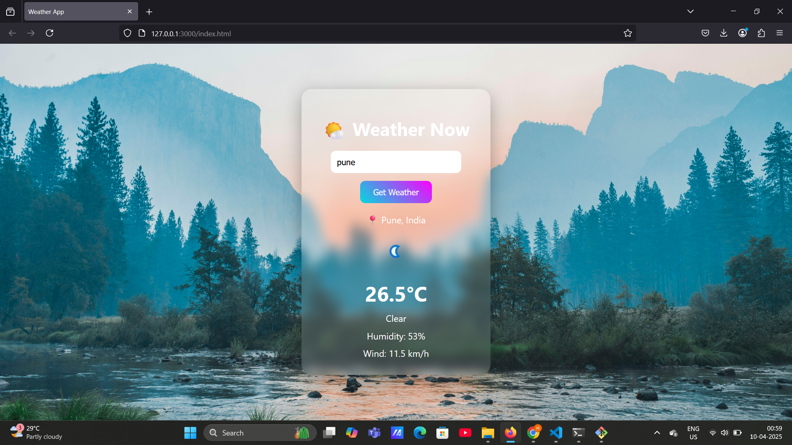

# 🌦️ Weather App

A simple and beautiful weather app that shows the current weather, temperature, humidity, wind speed, and updates the background based on weather conditions — all using the WeatherAPI.

🌐 **Live Demo**: [Click here](https://harishhchavan.github.io/weather-app/)

---

## 🚀 Features

- 🔍 Search weather by city
- 🌡️ Shows temperature in Celsius
- 💨 Humidity and wind speed display
- 🌤️ Weather icons and background images that match current weather
- ⚡ Smooth UI with animations and hover effects

---

## 📷 Screenshot




---

## 🛠️ Tech Stack

- HTML5
- CSS3
- JavaScript (Vanilla)
- WeatherAPI.com
- GitHub Pages (for deployment)

---

## 📁 How to Use Locally

```bash
git clone https://github.com/harishhchavan/weather-app.git
cd weather-app
open index.html
